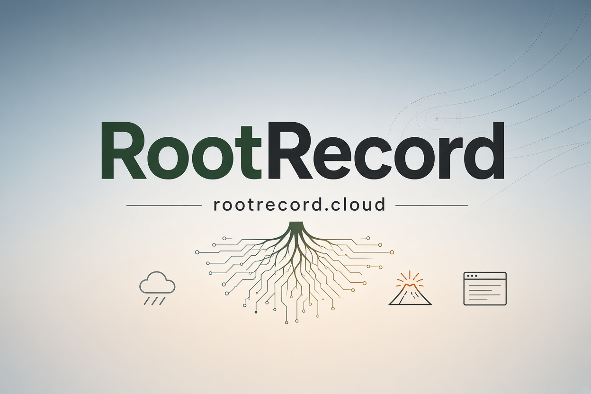

# RootRecord Cloud

Vercel project for `rootrecord.cloud`.

This repository owns the RootRecord public web experience: discovery, Kilauea and Volcano-area information, public guides, and web pages that call documented backend APIs.

## Vercel

Import this repository as its own Vercel project. Set the framework and root directory according to the web app added here. Keep secrets in Vercel environment variables, never in Git.

Local developers can register `scripts/register-auto-push.ps1` for the same
two-minute opt-in auto-push workflow used by the other RootRecord workspaces.

## First Run

- Windows: `install.ps1`
- Ubuntu/Debian: `./install.sh`
- Direct boot check: `python core/boot.py`

Boot creates missing runtime/log directories, installs dependencies from the package lockfile, and writes full output to `.runtime/logs/` while also showing it in the terminal.

## Boundary

This is a no-license web repository. Hosted processing belongs in RootRecord Core Processor. Operator controls belong in RootRecord Core Ops. RootMC development belongs in RootRecord RootMC.
